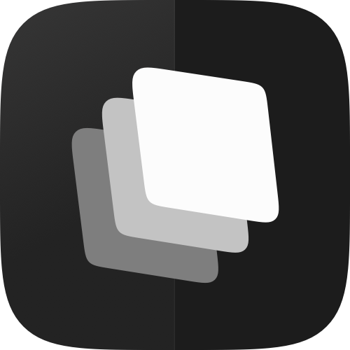

<p align="center">
  
</p>

<h1 align="center">Abstrakt</h1>

<p align="center">
  <strong>A library of beautifully customizable iPhone widgets.</strong>
</p>

<p align="center">
  Personalize your Home Screen with widgets that match your style.<br/>
  Adjust colors, fonts, appearance, and units — make every widget truly yours.
</p>

<p align="center">
  
  
  
  
  
</p>

---

## Screenshots

<p align="center">
  
  &nbsp;&nbsp;
  
  &nbsp;&nbsp;
  
</p>

<p align="center">
  <sub><b>Gallery</b> — browse widgets by framework &nbsp;·&nbsp; <b>Settings</b> — app font, units, permissions &nbsp;·&nbsp; <b>Library</b> — saved presets by size</sub>
</p>

---

## Features

### Widget Library

| Widget           | Description                                                    |
| ---------------- | -------------------------------------------------------------- |
| 🔋 **Battery**   | Device battery level and charging state via `UIDevice`         |
| 👟 **Steps**     | Daily step count powered by HealthKit                          |
| 🏃 **Activity**  | Activity summary with Today/Weekly display mode                |
| ❤️ **HeartRate** | Latest heart rate reading with live-updating timestamp         |
| 🌤️ **Weather**   | Current temperature and conditions powered by WeatherKit       |
| 📅 **Events**    | Upcoming or current calendar events via EventKit               |
| 🌅 **Daylight**  | Sunrise, sunset, and daylight window for your location         |
| 💾 **Storage**   | Device storage breakdown via `FileManager`                     |
| 📊 **Today**     | Daily overview combining date, weather, and activity           |
| 🚀 **Portal**    | App-launcher widget with date, weather, and App Intent buttons |

### Customization

- **Fonts** — Choose from SF Pro, SF Pro Rounded, Quicksand, and Fusion Pixel; preference is shared across the app and widgets
- **Appearance** — System, Light, and Dark modes per saved preset
- **Units** — Temperature unit, temperature display mode, and distance unit configured globally
- **Per-widget options** — Portal apps, Activity range, Events priority, and more
- **Saved presets** — Save any configured widget to your Library and pick it from the Home Screen widget editor
- **Alternate app icons** — Ten themed icons swappable from Settings

### Widget Sizes

- Home Screen: Small (170×170), Medium (364×170), Large (364×382)

---

## Tech Stack

| Technology       | Purpose                                                         |
| ---------------- | --------------------------------------------------------------- |
| **SwiftUI**      | Declarative UI framework for all screens and widget views       |
| **WidgetKit**    | Widget rendering, timelines, and intent configuration           |
| **App Groups**   | Shared data container between the main app and widget extension |
| **App Intents**  | Interactive buttons in the Portal widget                        |
| **HealthKit**    | Steps, activity, and heart rate data                            |
| **WeatherKit**   | Real-time weather from Apple Weather                            |
| **EventKit**     | Access to calendar events                                       |
| **CoreLocation** | Location services for weather and daylight widgets              |
| **UIKit**        | Device battery monitoring via `UIDevice`                        |
| **Foundation**   | Storage capacity via `FileManager`                              |

---

## Architecture

Abstrakt follows the **MVVM (Model-View-ViewModel)** pattern with strict separation between the host app, shared data, and the widget extension.

```
Abstrakt/
├── App/                        # App entry, screens, components, configuration
│   ├── Screens/                # Gallery, Library, Settings, Onboarding
│   ├── Components/             # Shared UI components
│   └── Configuration/          # Customization sheets (font picker, etc.)
├── Core/
│   ├── Models/                 # Widget presets, sizes, appearance modes, catalog
│   ├── Services/               # Framework wrappers (HealthKit, WeatherKit, etc.)
│   ├── Settings/               # Shared preference enums and storage keys
│   ├── Storage/                # App Group storage
│   └── Constants/              # App Group IDs, catalogs
├── DesignSystem/               # Design tokens — colors, fonts, spacing, radius
│   └── Fonts/                  # Custom font files
├── Widgets/                    # Extension-safe widget renderers
│   ├── SharedWidgetStyle.swift
│   ├── Battery/
│   ├── Steps/
│   ├── Activity/
│   ├── HeartRate/
│   ├── Weather/
│   ├── Events/
│   ├── Daylight/
│   ├── Storage/
│   ├── Today/
│   └── Portal/
└── AbstraktWidgetsExtension/   # WidgetKit extension bundle
    ├── AbstraktWidgetsBundle.swift
    ├── AbstraktNewWidgets.swift
    ├── SolidWidgetIntents.swift
    └── Shared/                 # SavedWidgetPreset, WidgetSharedStore
```

### Data Flow

```
Apple Framework → Core/Service → ViewModel → View
                                     ↓
                            App Group Storage → WidgetKit Extension → Shared Renderer
```

The main app reads from Apple frameworks, checks permissions, and writes prepared snapshots to App Group storage. The widget extension only reads from that shared container — it never requests HealthKit, CoreLocation, or WeatherKit access itself. Widget visuals live under `Widgets/` and compile into both targets, so the preview in the app and the widget on your Home Screen render the same code.

---

## Accessibility

| Feature           | Status                                                     |
| ----------------- | ---------------------------------------------------------- |
| Dynamic Type      | ✅ Supported — all text scales with user preferences       |
| Bold Text         | ✅ Supported — respects system bold text setting           |
| Dark Mode         | ✅ Full support — semantic color roles adapt to appearance |
| Permission States | ✅ Explicit empty and denied states across all widgets     |

---

## Requirements

- iOS 17.0+
- Xcode 15.0+
- Apple Developer Program membership (required for WeatherKit and HealthKit entitlements)

---

## Getting Started

1. Clone the repository

   ```bash
   git clone https://github.com/your-username/Abstrakt.git
   ```

2. Open the project in Xcode

   ```bash
   cd Abstrakt
   open Abstrakt.xcodeproj
   ```

3. Configure code signing
   - Copy `Abstrakt/Config/Signing.local.xcconfig.example` to `Signing.local.xcconfig`
   - Set your `DEVELOPMENT_TEAM` ID and `APP_GROUP_ID`
   - `Signing.local.xcconfig` is gitignored — your credentials stay local

4. Build and run on a simulator or device (iOS 17.0+)

---

## Team

Built by a team from **Apple Developer Academy @ BINUS Bali** as part of an App Extension challenge.

<table align="center">
  <tr>
    <td align="center" width="200">
      <br/>
      <strong>M. Salman Alfarisi</strong><br/>
      <sub>Developer</sub><br/>
      <a href="https://github.com/msafdev"></a>
      <a href="https://linkedin.com/in/msafdev"></a>
    </td>
    <td align="center" width="200">
      <br/>
      <strong>M. Darrel Prawira</strong><br/>
      <sub>Developer</sub><br/>
      <a href="https://github.com/dapraws"></a>
      <a href="https://www.linkedin.com/in/dapraws/"></a>
    </td>
    <td align="center" width="200">
      <br/>
      <strong>Daffa Yusranizar A.</strong><br/>
      <sub>Developer</sub><br/>
      <a href="https://github.com/daffayusranizar"></a>
      <a href="https://www.linkedin.com/in/daffayusranizar/"></a>
    </td>
    <td align="center" width="200">
      <br/>
      <strong>Syafiq Fii Dzilaalin</strong><br/>
      <sub>Designer</sub><br/>
      <a href="https://www.linkedin.com/in/syafiq-fii-dzilaalin-5a5200265/"></a>
    </td>
  </tr>
</table>

---

## License

This project is licensed under the MIT License — see the [LICENSE](LICENSE) file for details.
