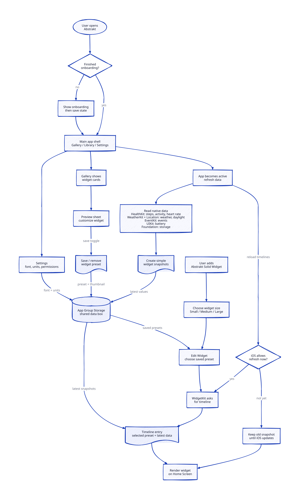

# Tech Report

  <!-- TODO: Replace with actual app logo -->
  

## 1. Abstrakt Team

Abstrakt is being built by a team from Apple Developer Academy @ BINUS Bali as part of an App Extension challenge.

The reason we started with widgets is pretty simple: Apple's native widgets are useful, but they often feel limited in styling and in the kind of data they can show. We wanted to explore whether we could make widgets that felt more personal, more flexible, and less like the default system options everyone already has.

<table align="center">
  <tr>
    <td align="center" width="260">
        
      <strong>M. Salman Alfarisi</strong> 
      Developer  
      
      
    </td>
    <td align="center" width="260">
        
      <strong>M. Darrel Prawira</strong> 
      Developer  
      
      
    </td>
  </tr>
</table>

<table align="center">
  <tr>
    <td align="center" width="260">
        
      <strong>Daffa Yusranizar A.</strong> 
      Developer  
      
      
    </td>
    <td align="center" width="260">
        
      <strong>Syafiq Fii Dzilaalin</strong> 
      Designer  
      
    </td>
  </tr>
</table>

## 2. Our Assumption

At the start, we thought App Extensions would let us go much deeper into iOS than they actually do.

Our first guess was that we could animate widgets easily, play with native-feeling UI, and maybe touch things around the system layer: notification badges, Control Center-style interactions, volume UI ideas, or something playful like BoringNotch on macOS.

So our assumption was: the hard part would be making a cool interaction and polishing the look. We did not expect the platform rules to become the main thing we had to design around.

## 3. The Exploration Log

We first explored the ideas that felt most exciting: animated widgets, quick controls, badges, and small moments that could live outside the main app.

That direction narrowed pretty fast. WidgetKit was useful, but not in the way we imagined. It was good for glanceable information, but strict about animation, refresh timing, and direct system control.

What we actually tried in code:

- A main app flow that starts with onboarding, then lands on a custom tab shell with Gallery, Library, and Settings.
- A gallery of widget ideas grouped by framework, like HealthKit, WeatherKit, EventKit, UIKit, Foundation, and Portal.
- A bottom-sheet preview where the user can inspect a widget and change a few real options, like Portal apps, Activity range, Events priority, font, and units.
- Shared widget renderers, so the preview inside the app and the actual WidgetKit extension are not two totally separate designs.
- A save toggle that writes and removes widget presets from App Group storage, then shows those saved widgets in the Library.
- Thumbnail generation for saved widgets, so the system widget picker can show a more visual preset choice.
- Real data snapshots for battery, steps, activity, heart rate, weather, daylight, events, and storage instead of only fake preview numbers.

The main thing we learned was that WidgetKit is closer to a snapshot than a tiny app. After that clicked, Abstrakt started to make more sense as a customization and preview tool, not a way to force widgets to behave like fully interactive surfaces.

The app now works by letting the main app do most of the work: checking permissions, reading system data, formatting it, saving presets, and writing values into shared storage. The WidgetKit extension then exposes three size slots, Small, Medium, and Large, and lets the user pick one of the saved presets from the system widget editor.

  

We also learned that "live data" sounds simple until each feature asks for something different. Weather needs location, Health needs permission, calendar needs access, storage needs filesystem readings, and WidgetKit can still refresh later than expected.

## 4. What We Tried and Dropped

We seriously considered a more playful system-overlay direction first: controls, badges, volume-inspired UI, and more animated widget behavior.

We dropped it because iOS does not give normal app extensions that kind of freedom. Some ideas were not possible, some were too restricted, and some belonged more to Apple-owned system surfaces than to a third-party app.

We also considered making every widget a separate WidgetKit entry with its own logic. That felt wrong after testing because it repeated too much work and made the extension harder to manage. The current app instead exposes generic size-based widgets and routes the selected preset into the right renderer.

The direction that held up was simpler: let the app handle customization and saved presets, then let WidgetKit render those presets cleanly.

## 5. Real Limitations Hit

WidgetKit refresh timing was the clearest limitation. We could ask for updates, but iOS can still throttle normal Home Screen widgets. That meant Abstrakt could not promise second-by-second animation in the regular widget area.

Permissions also changed the design. A user might deny Health, Calendar, or Location access, and the widget still has to look intentional. We could not just hide that behind fake data.

Some things also had to be verified in a real Apple developer setup, especially App Groups, signing, entitlements, WeatherKit access, and HealthKit behavior. Those were not just design choices; they shaped what the product could honestly do.

Saving also became more complicated than a button. The app now has to block saves when important permissions are missing, remove saved widgets cleanly, write preset data, save thumbnails, and keep WidgetKit's picker in sync.

## 6. The Revised Decision

Final decision:

Abstrakt should focus on customizable Home Screen widgets: better styling, clearer previews, saved presets, and real native data where it makes sense. The main app should be the place for browsing, previewing, permissions, and configuration; the widget extension should stay lightweight and render what the app prepares.

What changed from our starting assumption:

- We stopped trying to make widgets behave like mini apps.
- We focused on WidgetKit's actual strength: glanceable snapshots.
- We treated permissions and empty states as part of the product.
- We made styling and preview consistency the main value.
- We changed the architecture so shared data moves through App Groups instead of making the widget extension fetch everything itself.

## App Track Addendum

### About the Frameworks

The project needs multiple frameworks because one framework does not cover the whole idea. WidgetKit displays the widgets, SwiftUI builds the interface, App Groups share data, and native frameworks provide the actual information behind each widget.

It could work with only SwiftUI and WidgetKit, but then it would mostly be a static widget designer. The better version needs real native data.

### About Accessibility and Localization

We want the app to support readable text, dark mode, clear contrast, and permission states that make sense. Localization is not the first priority while the app structure is still changing, but the interface should not be written in a way that blocks it later.

### About Privacy

Abstrakt should only ask for data needed by the widgets the user chooses. If the user says no, the app should show a clear empty or denied state. The widget extension should read cached shared data instead of requesting sensitive access on its own.
